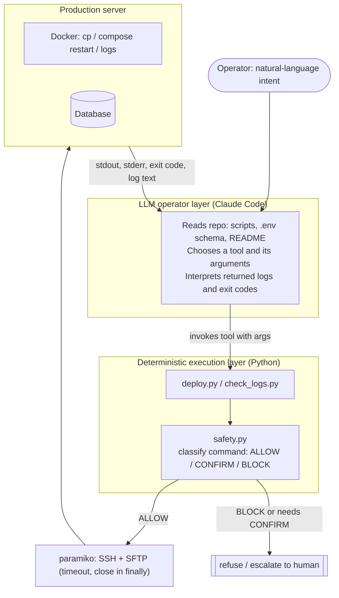

# AI DevOps Automation


[](https://www.python.org/downloads/)
[](https://opensource.org/licenses/MIT)

An LLM operator (Claude Code) driving a small, deterministic Python execution layer to run routine production operations over SSH: deploy a file, pull and triage Docker logs, apply a migration. The interesting part is not the automation, it is the boundary: the LLM decides *what* to do, reviewable and tested Python decides *how* and refuses to run irreversible commands.

[Русская версия](README_RUS.md)

## The problem

Routine DevOps is done by hand: SSH into a box, `scp` a file, `docker cp`, restart the container, tail the logs, read the traceback, edit, repeat. It is slow, and every manual step is a place to fat-finger a container name, forget the restart, or paste a `rm -rf` into the wrong shell. The judgement part (which file broke, what to change) genuinely needs a human or an LLM. The mechanical part (transfer, restart, tail, grep for errors) does not, and should be deterministic and auditable.

This project splits those two concerns cleanly.

## Architecture



**Components**

- **LLM operator layer** - Claude Code. It reads the repository (the scripts, the `.env` schema, this README, and `CLAUDE_CODE_PROMPT*.md` which encodes its operating policy), maps a natural-language request to a concrete tool call, and then reads the returned output to decide the next step. It never touches SSH or the shell directly; it can only invoke the Python tools.
- **Deterministic execution layer** - the `scripts/` package. Fixed-template commands over `paramiko` (SSH/SFTP). `deploy.py` uploads a file and restarts a container; `check_logs.py` pulls a Docker log tail and does a first-pass error triage. This layer holds the credentials and does the irreversible things, so it is the layer that is tested.
- **Safety gate** - `safety.py`. Every command that is about to hit the server is classified before execution (see below).
- **Feedback loop** - stdout/stderr/exit-code/log-text flow back to the LLM, which interprets them (found a `Traceback`, locate the file and line, propose a fix) and closes the loop.

## Key technical decisions

Each decision below is a place where a naive "let the AI run commands" design would break. The point of the split is to keep the dangerous, credential-bearing operations in code you can read and test, and give the LLM only the open-ended judgement it is actually good at.

### 1. Where the LLM/deterministic boundary sits

**Decision.** The LLM chooses the operation and its arguments and interprets results. It does not synthesize shell commands that reach the server unchecked. Execution is done by fixed command templates in Python (`docker cp {src} {container}:{dst}`, `docker compose restart {container}`, `docker logs {container} --tail {n}`).

**Why.** Anything irreversible or credential-bearing must be reviewable and testable. LLM output is neither. Keeping the templates in code means the surface the model can influence is just the *arguments*, not the command structure.

**Trade-off.** The model can still pass a bad argument (a poisoned container name, an injected path). That risk is handled by the safety gate below, not by trusting the model. The cost is less flexibility: an operation without a script cannot be run until a script exists for it.

### 2. Command-execution safety is enforced in code, not in the prompt

**Decision.** `safety.py` classifies every command into `ALLOW` / `CONFIRM` / `BLOCK` before it is sent. `assert_safe()` is wired into `deploy.py` ahead of each `exec_command`.

- `ALLOW` - runs unattended (the tool's own `docker cp` / `restart` / `logs`).
- `CONFIRM` - destructive but recoverable; refused unless a human explicitly acknowledges (recursive delete, `DROP TABLE`, `TRUNCATE`, unfiltered `DELETE`, `git push --force`, `docker volume rm`, `shutdown`).
- `BLOCK` - catastrophic or irreversible; refused even with confirmation (`rm -rf /`, `mkfs`, `dd of=/dev/...`, `DROP DATABASE`).

**Why.** A policy in the prompt ("never run `rm -rf`") is a request, not a guarantee. The same policy as a gate in code, covered by tests, is enforceable. Three levels rather than a boolean because "remove a container" and "drop the database" deserve different handling. Whitespace and newlines are collapsed before matching so a command cannot dodge a rule by wrapping across lines.

**Trade-off.** It is pattern-based (deny-by-signature), not a full shell parser, so it is a backstop / defense-in-depth layer, not a sandbox. It is deliberately conservative: an unrecognized command is `ALLOW`, because these tools run inside an already-authenticated SSH session and the goal is to catch the small set of irreversible foot-guns, not to whitelist every command.

### 3. SSH/Docker failures fail loud and fail closed

**Decision.** Every SSH connection sets `timeout=10`, is closed in a `finally` block, and any exception prints the error and exits non-zero (`sys.exit(1)`). Deploy always uploads to `/tmp` first, then `docker cp` into the container.

**Why.** A hung socket with no timeout is how an automation quietly stalls forever (a real failure mode this repo's parent project has been bitten by). Exiting non-zero lets a caller or CI detect the failure instead of marching on. Staging in `/tmp` before copying into the running container means a failed transfer never half-writes a file into a live service.

**Trade-off.** The MVP uses SSH password auth from `.env`. That is convenient but weaker than keys; the [Security](#security) section documents the production path (keys, vault, firewall).

### 4. Idempotency, honestly

**Decision / current state.** `check_logs.py` is read-only and side-effect free, so it is safely repeatable. `deploy.py` is last-write-wins file replacement plus a restart: re-running the same deploy converges to the same container state, so it is repeatable, but it is *not* transactional - there is no automatic rollback beyond redeploying the previous file. Database migrations (DDL) are not automatically idempotent; the documented workflow verifies the result with `DESCRIBE` after applying.

**Why it is stated this way.** Claiming full idempotency here would be false. Read operations are safe to retry; deploy is convergent but not atomic; migrations need a human-verified check. Being precise about which is which is the whole point.

## Results

Wall-clock of the automated path versus doing the same steps by hand, measured on the author's setup:

| Operation | Manual | Automated | Notes |
|---|---|---|---|
| Deploy one file to a container | ~7 min | ~15 sec | single file, one container, restart included |
| Pull and triage logs | ~2 min | ~10 sec | 50-line tail, keyword error scan |
| Apply a single-column DDL migration | ~10 min | ~30 sec | one `ALTER TABLE`, verified with `DESCRIBE` |

These are indicative timings from real use, not a benchmark. They scale with file size, log volume, and network latency, and the "manual" baseline is a human typing the same commands over SSH.

## Stack

- **Python 3.10+**, [`paramiko`](https://www.paramiko.org/) (SSH/SFTP), [`python-dotenv`](https://github.com/theskumar/python-dotenv)
- **Docker** on the target (`docker cp`, `docker compose`, `docker logs`)
- **LLM operator:** [Claude Code](https://claude.ai/claude-code)
- **Dev / CI:** `pytest`, `ruff`, GitHub Actions

## Quick start

```bash
git clone https://github.com/Baho73/ai-devops-automation.git
cd ai-devops-automation
pip install -r requirements.txt
cp .env.example .env      # then edit with your server credentials
```

Deploy a file and check the logs:

```bash
python scripts/deploy.py app.py /app/app.py
python scripts/check_logs.py web_container 50
```

`CLAUDE_CODE_PROMPT_EN.md` is the prompt that turns Claude Code into the operator described above.

### Environment variables

Set in `.env` (git-ignored). Names and purpose only; never commit values.

| Variable | Purpose |
|---|---|
| `SERVER_HOST` | Target server address |
| `SERVER_USER` | SSH user (default `root`) |
| `SERVER_PASSWORD` | SSH password (MVP; prefer keys in production) |
| `SERVER_PORT` | SSH port (default `22`) |
| `CONTAINER_NAME` | Default Docker container |
| `APP_PATH` | Application path inside the container |
| `DB_*` | Database connection for migrations |
| `TELEGRAM_*` | Optional deploy notifications |

## Tests

SSH, SFTP, and Docker are fully mocked; the suite makes no network calls and touches no real server.

```bash
pip install -r requirements-dev.txt
pytest
```

Covered:

- **`safety.py`** - the ALLOW/CONFIRM/BLOCK classification and `assert_safe()`, including that catastrophic commands are refused even with confirmation, that a subdirectory `rm -rf` is `CONFIRM` while a root wipe is `BLOCK`, SQL case-insensitivity, and that a multi-line command cannot dodge a rule.
- **`check_logs.py`** - error detection on log text (clean vs. traceback vs. stderr `CRITICAL`), the exact `docker logs` command built, the missing-credentials guard.
- **`deploy.py`** - the exact `docker cp` / `docker compose restart` commands built, that container steps are skipped when no container path is given, the missing-credentials guard, and that an injected container path (`...; rm -rf /`) is blocked by the safety gate before it reaches the server.

CI (`.github/workflows/ci.yml`) runs `ruff` and `pytest` on Python 3.10, 3.11, and 3.12.

## Security

**Current (MVP)**
- Credentials in `.env` (git-ignored)
- SSH password authentication
- Command-safety gate (`safety.py`) in front of execution

**Recommended for production**
- SSH keys instead of passwords
- Secrets in a vault (HashiCorp Vault, AWS Secrets Manager)
- Firewall: allow SSH from specific IPs only
- Rotate credentials; enable 2FA where possible

## Project structure

```
ai-devops-automation/
  scripts/
    deploy.py            # SFTP upload + docker cp + compose restart (safety-gated)
    check_logs.py        # docker logs tail + keyword error triage
    safety.py            # command classifier: ALLOW / CONFIRM / BLOCK
  tests/
    test_safety.py       # classification + assert_safe
    test_check_logs.py   # log parsing + error detection (paramiko mocked)
    test_deploy.py       # command construction + injection guard (paramiko mocked)
  .github/workflows/ci.yml
  CLAUDE_CODE_PROMPT_EN.md / CLAUDE_CODE_PROMPT.md   # operator prompt (EN / RU)
  .env.example
  requirements.txt / requirements-dev.txt
  pyproject.toml
```

## License

MIT - see [LICENSE](LICENSE).
