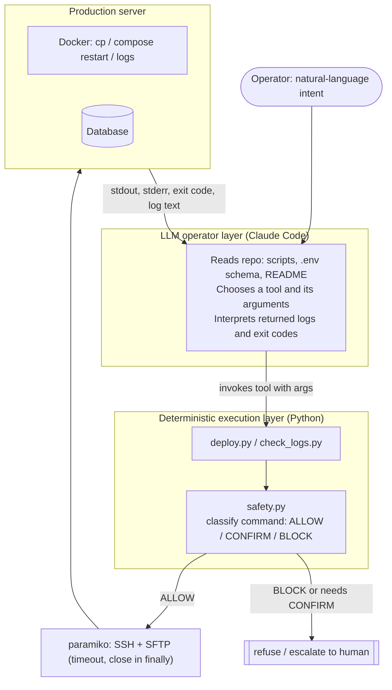

# AI DevOps Automation


[](https://www.python.org/downloads/)
[](https://opensource.org/licenses/MIT)

LLM-оператор (Claude Code) управляет небольшим детерминированным слоем на Python, который выполняет рутинные операции на проде через SSH: выкатить файл, забрать и разобрать логи Docker, применить миграцию. Главное здесь не автоматизация, а граница ответственности: LLM решает, *что* сделать, а проверяемый и покрытый тестами Python решает, *как*, и отказывается запускать необратимые команды.

[English version](README.md)

## Проблема

Рутинный DevOps делается руками: зайти по SSH, `scp` файл, `docker cp`, перезапустить контейнер, посмотреть логи, прочитать трейсбек, поправить, повторить. Это медленно, и каждый ручной шаг - место, где можно опечататься в имени контейнера, забыть рестарт или вставить `rm -rf` не в тот шелл. Та часть, где нужно суждение (какой файл сломался, что менять), действительно требует человека или LLM. Механическая часть (передать, перезапустить, забрать логи, найти ошибки) - нет, и должна быть детерминированной и проверяемой.

Проект разделяет эти две задачи.

## Архитектура



**Компоненты**

- **Слой LLM-оператора** - Claude Code. Читает репозиторий (скрипты, схему `.env`, этот README и `CLAUDE_CODE_PROMPT*.md` с операционной политикой), переводит запрос на естественном языке в конкретный вызов инструмента, затем читает возвращённый вывод и решает следующий шаг. Он никогда не трогает SSH или шелл напрямую - только вызывает Python-инструменты.
- **Детерминированный слой исполнения** - пакет `scripts/`. Команды с фиксированными шаблонами поверх `paramiko` (SSH/SFTP). `deploy.py` загружает файл и перезапускает контейнер; `check_logs.py` забирает хвост логов Docker и делает первичную триаж-проверку на ошибки. Этот слой держит секреты и делает необратимые вещи, поэтому именно он покрыт тестами.
- **Гейт безопасности** - `safety.py`. Каждая команда классифицируется перед выполнением (см. ниже).
- **Обратная связь** - stdout/stderr/код возврата/текст логов возвращаются в LLM, который их интерпретирует (нашёл `Traceback`, определил файл и строку, предложил фикс) и замыкает цикл.

## Ключевые технические решения

Каждое решение ниже - место, где наивный подход «пусть ИИ сам гоняет команды» ломается. Смысл разделения: держать опасные операции с секретами в коде, который можно прочитать и протестировать, а LLM оставить только открытое суждение, в котором он реально силён.

### 1. Где проходит граница LLM / детерминированного кода

**Решение.** LLM выбирает операцию, её аргументы и интерпретирует результат. Он не синтезирует shell-команды, которые доходят до сервера без проверки. Исполнение - фиксированными шаблонами команд в Python (`docker cp {src} {container}:{dst}`, `docker compose restart {container}`, `docker logs {container} --tail {n}`).

**Почему.** Всё необратимое и связанное с секретами должно быть проверяемым и тестируемым. Вывод LLM - ни то, ни другое. Шаблоны в коде означают, что модель влияет только на *аргументы*, а не на структуру команды.

**Компромисс.** Модель всё ещё может передать плохой аргумент (подставленное имя контейнера, инъекция в путь). Этот риск закрывает гейт безопасности ниже, а не доверие к модели. Цена - меньше гибкости: операцию без скрипта нельзя выполнить, пока скрипт не написан.

### 2. Безопасность выполнения команд - в коде, а не в промпте

**Решение.** `safety.py` классифицирует каждую команду в `ALLOW` / `CONFIRM` / `BLOCK` перед отправкой. `assert_safe()` встроен в `deploy.py` перед каждым `exec_command`.

- `ALLOW` - выполняется без участия человека (собственные `docker cp` / `restart` / `logs`).
- `CONFIRM` - деструктивно, но обратимо; отказ без явного подтверждения человека (рекурсивное удаление, `DROP TABLE`, `TRUNCATE`, `DELETE` без `WHERE`, `git push --force`, `docker volume rm`, `shutdown`).
- `BLOCK` - катастрофично или необратимо; отказ даже с подтверждением (`rm -rf /`, `mkfs`, `dd of=/dev/...`, `DROP DATABASE`).

**Почему.** Политика в промпте («никогда не запускай `rm -rf`») - просьба, а не гарантия. Та же политика как гейт в коде, покрытый тестами, - уже гарантия. Три уровня вместо булева флага, потому что «удалить контейнер» и «дропнуть базу» заслуживают разной обработки. Пробелы и переносы строк схлопываются перед сопоставлением, чтобы команда не обошла правило переносом на несколько строк.

**Компромисс.** Это сопоставление по сигнатурам (deny-by-signature), а не полноценный парсер шелла, поэтому это подстраховка / defense-in-depth, а не песочница. Намеренно консервативно: неизвестная команда - `ALLOW`, потому что инструменты работают внутри уже аутентифицированной SSH-сессии, и цель - поймать небольшой набор необратимых грабель, а не белым списком описывать каждую команду.

### 3. Сбои SSH/Docker падают громко и безопасно

**Решение.** Каждое SSH-соединение с `timeout=10`, закрывается в `finally`, а любое исключение печатает ошибку и выходит с ненулевым кодом (`sys.exit(1)`). Deploy всегда сначала загружает в `/tmp`, потом `docker cp` в контейнер.

**Почему.** Зависший сокет без таймаута - это как автоматизация тихо встаёт навсегда (реальный сценарий, на котором обжигался родительский проект). Ненулевой код возврата позволяет вызвавшему или CI обнаружить сбой, а не идти дальше. Промежуточный `/tmp` перед копированием в живой контейнер означает, что сорвавшаяся передача не запишет файл наполовину в работающий сервис.

**Компромисс.** В MVP используется парольная SSH-аутентификация из `.env`. Это удобно, но слабее ключей; раздел [Безопасность](#безопасность) описывает продовый путь (ключи, vault, firewall).

### 4. Идемпотентность, честно

**Решение / текущее состояние.** `check_logs.py` только читает и не имеет побочных эффектов, поэтому безопасно повторяем. `deploy.py` - это замена файла по принципу last-write-wins плюс рестарт: повторный запуск того же деплоя сходится к тому же состоянию контейнера, то есть повторяем, но *не* транзакционен - нет автоотката, кроме повторной выкатки предыдущего файла. Миграции БД (DDL) не идемпотентны автоматически; документированный процесс проверяет результат через `DESCRIBE` после применения.

**Почему так сформулировано.** Заявить полную идемпотентность здесь было бы неправдой. Операции чтения безопасно повторять; deploy сходящийся, но не атомарный; миграции требуют проверки человеком. Точность в том, что именно к чему относится, - и есть весь смысл.

## Результаты

Реальное время автоматического пути против тех же шагов вручную, измерено на стенде автора:

| Операция | Вручную | Автоматически | Условия |
|---|---|---|---|
| Выкатить один файл в контейнер | ~7 мин | ~15 сек | один файл, один контейнер, с рестартом |
| Забрать и разобрать логи | ~2 мин | ~10 сек | хвост 50 строк, поиск ошибок по ключевым словам |
| Применить DDL-миграцию одного столбца | ~10 мин | ~30 сек | один `ALTER TABLE`, проверка через `DESCRIBE` |

Это ориентировочные цифры из реального использования, не бенчмарк. Они зависят от размера файла, объёма логов и сетевой задержки, а базовая линия «вручную» - это человек, набирающий те же команды по SSH.

## Стек

- **Python 3.10+**, [`paramiko`](https://www.paramiko.org/) (SSH/SFTP), [`python-dotenv`](https://github.com/theskumar/python-dotenv)
- **Docker** на целевом сервере (`docker cp`, `docker compose`, `docker logs`)
- **LLM-оператор:** [Claude Code](https://claude.ai/claude-code)
- **Dev / CI:** `pytest`, `ruff`, GitHub Actions

## Быстрый старт

```bash
git clone https://github.com/Baho73/ai-devops-automation.git
cd ai-devops-automation
pip install -r requirements.txt
cp .env.example .env      # затем впишите креды своего сервера
```

Выкатить файл и посмотреть логи:

```bash
python scripts/deploy.py app.py /app/app.py
python scripts/check_logs.py web_container 50
```

`CLAUDE_CODE_PROMPT.md` - промпт, превращающий Claude Code в описанного выше оператора.

### Переменные окружения

Задаются в `.env` (в `.gitignore`). Только имена и назначение; значения не коммитить.

| Переменная | Назначение |
|---|---|
| `SERVER_HOST` | Адрес целевого сервера |
| `SERVER_USER` | SSH-пользователь (по умолчанию `root`) |
| `SERVER_PASSWORD` | SSH-пароль (MVP; в проде лучше ключи) |
| `SERVER_PORT` | SSH-порт (по умолчанию `22`) |
| `CONTAINER_NAME` | Контейнер Docker по умолчанию |
| `APP_PATH` | Путь приложения внутри контейнера |
| `DB_*` | Подключение к БД для миграций |
| `TELEGRAM_*` | Опциональные уведомления о деплое |

## Тесты

SSH, SFTP и Docker полностью мокаются; набор не делает сетевых вызовов и не трогает реальный сервер.

```bash
pip install -r requirements-dev.txt
pytest
```

Покрыто:

- **`safety.py`** - классификация ALLOW/CONFIRM/BLOCK и `assert_safe()`: в том числе что катастрофические команды отклоняются даже с подтверждением, что `rm -rf` по подкаталогу - это `CONFIRM`, а снос корня - `BLOCK`, регистронезависимость SQL и что многострочная команда не обходит правило.
- **`check_logs.py`** - детекция ошибок в тексте логов (чисто vs. трейсбек vs. `CRITICAL` в stderr), точная собираемая команда `docker logs`, guard на отсутствие кредов.
- **`deploy.py`** - точные собираемые команды `docker cp` / `docker compose restart`, пропуск шагов контейнера, когда путь не задан, guard на отсутствие кредов, и что подставленный путь контейнера (`...; rm -rf /`) блокируется гейтом безопасности до отправки на сервер.

CI (`.github/workflows/ci.yml`) гоняет `ruff` и `pytest` на Python 3.10, 3.11 и 3.12.

## Безопасность

**Сейчас (MVP)**
- Креды в `.env` (в `.gitignore`)
- Парольная SSH-аутентификация
- Гейт безопасности команд (`safety.py`) перед выполнением

**Рекомендации для прода**
- SSH-ключи вместо паролей
- Секреты в vault (HashiCorp Vault, AWS Secrets Manager)
- Firewall: SSH только с определённых IP
- Ротация кредов; 2FA где возможно

## Структура проекта

```
ai-devops-automation/
  scripts/
    deploy.py            # SFTP-загрузка + docker cp + compose restart (через гейт безопасности)
    check_logs.py        # хвост docker logs + триаж ошибок по ключевым словам
    safety.py            # классификатор команд: ALLOW / CONFIRM / BLOCK
  tests/
    test_safety.py       # классификация + assert_safe
    test_check_logs.py   # разбор логов + детекция ошибок (paramiko замокан)
    test_deploy.py       # сборка команд + guard от инъекции (paramiko замокан)
  .github/workflows/ci.yml
  CLAUDE_CODE_PROMPT_EN.md / CLAUDE_CODE_PROMPT.md   # промпт оператора (EN / RU)
  .env.example
  requirements.txt / requirements-dev.txt
  pyproject.toml
```

## Лицензия

MIT - см. [LICENSE](LICENSE).
